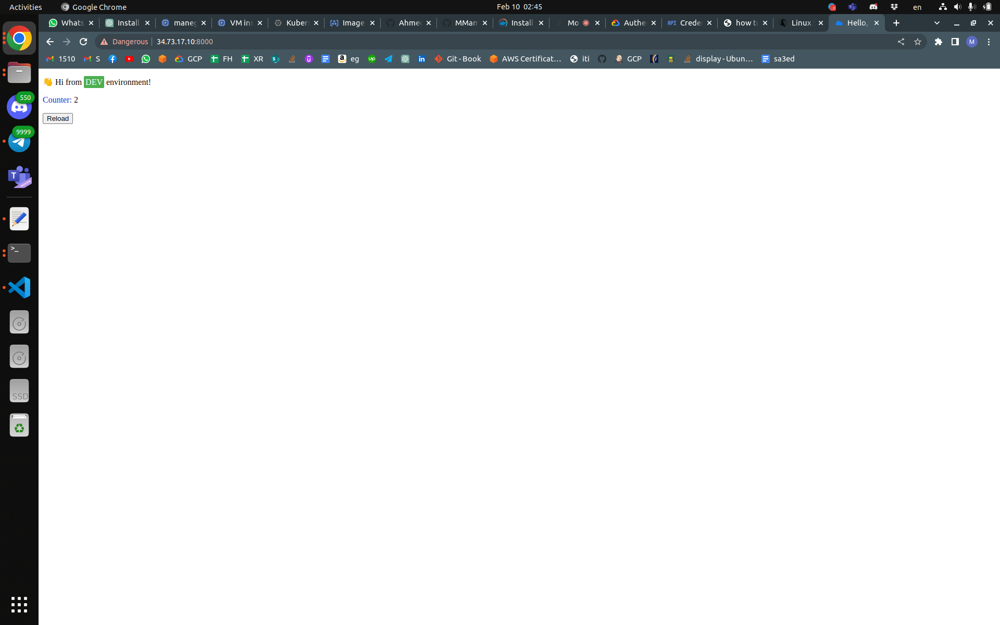

# GCP_Terraform

## - Archtecture

### - Creating a VPC with 2 subnets

### - one of the subnet called **Mangement Subnet** that have a Private VM that can Access Internet through NAT Gateway

### - the other subnet called **Restricted Subnet** that include full private GKE-Cluster that only be accessed through the **Mangment Subnet** only , and cannot access the Internet

---

## Creating IaC using Terraform

## **Note : files included in "terraform_files" Directory**

### main.tf include all main parameters

```terraform
 module "services" {
  source = "./svc"

}
module "network" {
  source                    = "./networks"
  project_name              = var.project_name
  vpc_name                  = "project-vpc"
  subnets_auto_create_state = "false"
  routing_mode              = "GLOBAL"
  # depends_on_list           = [""]
  # depends_on_list = [module.services.compute_api]

  subnet_name_1            = var.manegement_subnet_name # will have private vm ( private ip ) no public and it will use NAT
  subnet_cidr_1            = var.manegement_subnet_cidr
  subnet_region_1          = "us-east1"
  private_ip_google_access = "true"

  subnet_name_2                = "restricted-subnet" # will have a full private GKE ( private control Plan) and 
  subnet_cidr_2                = "10.6.0.0/24"       # only the mangment subnet only can access its
  subnet_region_2              = "us-east1"
  secondary_pods_ip_range_name = var.secondary_pods_ip_range_name
  secondary_pods_ip_cidr_range = "10.15.0.0/16"
  secondary_svc_ip_range_name  = var.secondary_svc_ip_range_name
  secondary_svc_ip_cidr_range  = "10.16.0.0/16"

  router_name            = "nat-router"
  nat_ip_allocate_option = "MANUAL_ONLY"
  nat_name               = "public-nat"
}
# iam roles will be created tf too
module "management_ec2" {
  source           = "./vm"
  vpc_self_link    = module.network.vpc_self_link
  subnet_self_link = module.network.management_subnet_self_link
  instance_zone    = "us-east1-b"
  instance_name    = "manegment-instance"
  machine_type     = "e2-small"
  instnace_image   = "ubuntu-2204-jammy-v20230114"
  nat_ip           = module.network.nat_ip
  # nat_ip           = module.management_ec2.managment_instnace
}


module "Private-GKE" {
  source              = "./GKE"
  cluster_name        = "private-cluster"
  cluster_location    = "us-east1-b"
  cluster_subnet      = module.network.restricted_subnet_self_link
  cluster_vpc         = module.network.vpc_self_link
  pods_range_name     = var.secondary_pods_ip_range_name
  svc_range_name      = var.secondary_svc_ip_range_name
  access_cidr_block   = var.manegement_subnet_cidr
  access_display_name = var.manegement_subnet_name
}


```

## After applying the Infrastracture you have to access the private vm on manegment subnet to deploy and access the GKE-Cluster

```bash
$ gcloud container clusters get-credentials private-cluster --zone us-east1-b --project mm-iti-cairo-2023
Fetching cluster endpoint and auth data.
kubeconfig entry generated for private-cluster.
```

```bash
$ kubectl get nodes
NAME                                        STATUS   ROLES    AGE     VERSION
gke-private-cluster-general-ecb7ef50-61m5   Ready    <none>   3h29m   v1.24.8-gke.2000
gke-private-cluster-general-ecb7ef50-9rsn   Ready    <none>   3h29m   v1.24.8-gke.2000
```

## To start deploy your app you have to push it first on a docker registry , in this project i used GCR

### **Note : you have to configure login crediential of docker with gcloud , use this link to do so <https://cloud.google.com/container-registry/docs/advanced-authentication#linux>**

### **Note : if you didn't user script when creating your private vm you have to install them manual after ssh-ing on it** , required apps will be in vm-requirment.txt

```bash
${source-app-path}/docker build . -t gcr.io/mm-iti-cairo-2023/devops--app-v2:v1.1 
docker push gcr.io/mm-iti-cairo-2023/devops--app-v2:v1.1
```

```bash
$ kubectl create -f depl.yaml
deployment.apps/devops-challenge-app created
```

```bash
$ kubectl get deployments
NAME                   READY   UP-TO-DATE   AVAILABLE   AGE
devops-challenge-app   2/2     2            2           13s
```

```bash
$ kubectl expose deployment devops-challenge-app --type LoadBalancer --target-port 8000 --port 8000
service/devops-challenge-app exposed
```

```bash
$ kubectl expose deployment devops-challenge-app --type LoadBalancer --target-port 8000 --port 8000 -oyaml --dry-run=client > expose.yaml
$ cat expose
```

```yaml
apiVersion: v1
kind: Service
metadata:
  creationTimestamp: null
  labels:
    app: devops-challenge-app
  name: devops-challenge-app
spec:
  ports:
  - port: 8000
    protocol: TCP
    targetPort: 8000
  selector:
    app: devops-challenge-app
  type: LoadBalancer
status:
  loadBalancer: {}
```


#### **All docker and yaml available in side "kubernetes" folder you can check them**

```bash
$ kubectl get service
NAME                   TYPE           CLUSTER-IP    EXTERNAL-IP   PORT(S)          AGE
devops-challenge-app   LoadBalancer   10.16.82.46   34.73.17.10   8000:30667/TCP   58s
kubernetes             ClusterIP      10.16.0.1     <none>        443/TCP          3h38m
```

```bash
$ curl 34.73.17.10:8000
```

```html
<!DOCTYPE html>
<html lang="en">
<head>
<meta charset="utf-8" />
<link rel="stylesheet" type="text/css" href="/static/css/style.css?v=64d12fd9c6484b319e192082c6c64592">
<title>Hello, world!</title>
</head>
<body>
<div>
<p>
👋 Hi from
<span class="highlight" id="DEV">DEV</span>
environment!
</p>
<p><span class="counter">Counter:</span> 21</p>
</div>
<div>
<button type="button" onClick="window.location.reload()">Reload</button>
</div>
</body>
</html>
```



---

## the following screen shots from GCP Console to illustrate the infrastracture
